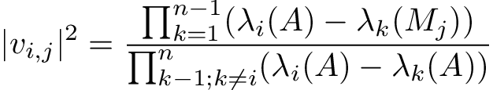

# Eigenvector-Eigenvalue Identity Code

This code generates a random Hermitian matrix of dimension n and then calculates the norm squared of the elements of the normed eigenvectors, |v<sub>i,j</sub>|<sup>2</sup>.
It then verifies that the result is equivalent to that calculated with numpy.
To use this code simply run the file as is to numerically verify the formula:
```
python E2.py
0.08307505701632452
0.08307505701632453
[[ True  True  True  True  True  True  True  True]
 [ True  True  True  True  True  True  True  True]
 [ True  True  True  True  True  True  True  True]
 [ True  True  True  True  True  True  True  True]
 [ True  True  True  True  True  True  True  True]
 [ True  True  True  True  True  True  True  True]
 [ True  True  True  True  True  True  True  True]
 [ True  True  True  True  True  True  True  True]]
```
where the first two numbers are |v<sub>0,1</sub>|<sup>2</sup> calculated with the new formula and numpy and the array is the comparison of each element of each eigenvector.

Alternatively, import it into your own code as:
```
import E2
E2.vijsq(H, i, j)
```
which returns the norm square of the j<sup>th</sup> element of the i<sup>th</sup> eigenvector where H is a Hermitian matrix of numpy's matrix class, and i and j are indices 0 &le; i,j &le; n.

## Formula
The new formula is:



## References
For further references see [arXiv:1911.xxxxx](https://arxiv.org/abs/1911.xxxxx).
We first discovered this in the context of neutrino oscillations in matter in [arXiv:1907.02534](https://arxiv.org/abs/1907.02534) and presented several proofs in [arXiv:1908.03795](https://arxiv.org/abs/1908.03795).
We believe that the first instance of anything like this expression appeared in Karl Löwner. Über monotone Matrixfunktionen. Math. Z., 38(1):177–216, 1934.
The first instance of this expression seems to have appeared in R. C. Thompson. Principal submatrices of normal and Hermitian matrices. Illinois J. Math., 10:296–308, 1966.
